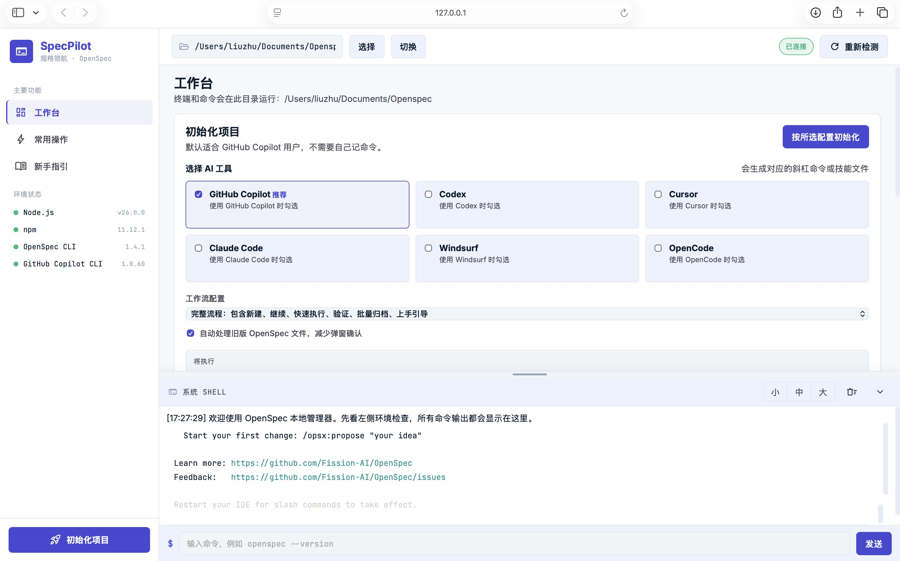

# SpecPilot 规格领航

SpecPilot 是一个**本地运行的中文 Web 应用**，把 OpenSpec 工作流、GitHub Copilot CLI 与一个真实系统终端整合到同一个网页里。它用图形界面替你完成环境检查、工具安装、项目初始化和常用命令，让不熟悉命令行的用户也能顺畅使用 OpenSpec。



---

## ✨ 功能总览

### 1. 环境状态检查（侧边栏）
- 自动检测 **Node.js、npm、OpenSpec CLI、GitHub Copilot CLI** 是否安装。
- 实时显示每个工具的安装状态与**纯版本号**（如 `1.0.60`）。
- 缺失的工具会显示「安装」按钮，点击即可在页面内一键安装：
  - OpenSpec CLI：`npm install -g @fission-ai/openspec@latest`
  - GitHub Copilot CLI：`npm install -g @github/copilot`
- 检测带超时保护，命令挂起也不会卡死页面。

### 2. 工作目录管理（顶栏）
- 在页面里直接选择/切换要管理的项目文件夹。
- 提供可视化目录浏览弹窗（上一级、用户目录、快速根目录跳转）。
- 切换后，环境检测、常用命令和真实终端都会在该目录下运行。

### 3. 项目初始化向导（工作台）
- 勾选你使用的 AI 工具（GitHub Copilot、Codex、Cursor、Claude Code、Windsurf、OpenCode），自动生成对应的斜杠命令或技能文件。
- 选择工作流配置：
  - **核心流程**：propose、explore、apply、sync、archive
  - **完整流程**：在核心之外再加 new、continue、ff、verify、bulk-archive、onboard
- 可选「自动处理旧版 OpenSpec 文件」减少弹窗确认。
- 实时预览将要执行的 `openspec init` 命令，点一下即可初始化。

### 4. 常用操作（一键命令）
更新命令、打开仪表盘、探索想法、查看变更、查看规格、一键校验、归档变更、打开 Copilot 等常用 OpenSpec 操作，全部做成按钮，点击即在终端执行。

### 5. 内置真实终端
- 页面底部嵌入**真实系统终端**（基于 `node-pty` + `xterm.js`）。
  - macOS 使用系统 shell，Windows 使用系统命令解释器。
- 支持自定义命令输入、清空、拖拽调整高度、收起/展开。
- 命令的启动、输出、失败与完成状态实时回显。

### 6. 新手指引
内置一页 OpenSpec 标准流程说明（explore → propose → apply → sync → archive），照着走即可。

---

## 🚀 安装与初始化

### 环境要求
- **Node.js ≥ 20.19.0**（推荐使用 LTS 版本）
- npm（随 Node.js 一起安装）

### 安装依赖
首次使用，在项目目录运行：

```bash
npm install
```

> 真实终端依赖 `node-pty`，`npm install` 会一并安装。如果之后页面提示真实终端启动失败，请改用 Node.js LTS 版本后重新 `npm install`。

---

## 📖 使用方法

### 启动应用

**macOS / Linux**

```bash
npm run dev
```

然后在浏览器打开：

```text
http://127.0.0.1:4317
```

> ⚠️ 不要直接双击打开 `public/index.html`。以 `file://` 方式打开时，浏览器无权调用本地命令接口，检测、安装和终端功能都无法使用。

如果终端提示 `npm: command not found`，先补全 Homebrew 路径再启动：

```bash
export PATH="/opt/homebrew/bin:/usr/local/bin:$PATH"
npm run dev
```

也可以直接双击 `start.command`，它会自动补上常见的 Homebrew 路径。

**Windows**

```powershell
npm run dev
```

也可以双击 `start.bat`，或在 PowerShell 中运行：

```powershell
.\start.ps1
```

### 推荐使用流程

1. **检查环境**：打开页面，看左侧「环境状态」。缺 OpenSpec 或 Copilot 就点「安装」。
2. **选择工作目录**：在顶栏选择要管理的项目文件夹。
3. **初始化项目**：在「工作台」勾选 AI 工具、选择工作流配置，点「按所选配置初始化」。
4. **梳理与提案**：在 IDE 聊天里用 `/opsx:explore` 理清需求，再用 `/opsx:propose` 生成 proposal、tasks 和 spec delta。
5. **确认变更**：回到页面点「查看变更」或「打开仪表盘」，不放心时点「一键校验」。
6. **执行实现**：让 Copilot 执行 `/opsx:apply` 按 tasks 写代码，完成后再「一键校验」。
7. **同步归档**：先 `/opsx:sync` 同步规格，再点「归档变更」或 `/opsx:archive` 把完成的 change 移入 archive。

---

## 🧱 技术栈与结构

- **后端**：Node.js 原生 `http` 服务（`server.js`），提供静态资源、状态检测、工作目录管理、OpenSpec 配置写入等接口，并用 SSE 实时推送状态。
- **终端**：`ws`（WebSocket）+ `node-pty` 提供真实 shell，前端用 `xterm.js` 渲染。
- **前端**：原生 HTML / CSS / JS（`public/` 目录），无构建步骤。

```text
server.js              本地服务与所有接口
public/
  index.html           页面结构
  styles.css           界面样式
  app.js               前端逻辑（状态、终端、初始化、目录选择等）
start.command          macOS 一键启动
start.bat / start.ps1  Windows 一键启动
main.jpg               程序界面截图
```

### 主要接口

| 方法 | 路径 | 说明 |
|------|------|------|
| GET | `/api/status` | 检测各工具状态与版本 |
| GET / POST | `/api/workspace` | 读取 / 切换工作目录 |
| GET | `/api/directories` | 浏览目录（用于选择文件夹）|
| POST | `/api/openspec/profile` | 写入核心 / 完整工作流配置 |
| GET | `/api/events` | SSE 实时状态推送 |
| WS | `/terminal` | 真实终端 WebSocket |

> 可用环境变量 `PORT`、`HOST` 自定义监听地址（默认 `127.0.0.1:4317`）。

---

## 🛠️ 常见问题

- **页面功能都用不了**：确认是通过 `http://127.0.0.1:4317` 访问，而不是直接打开 HTML 文件。
- **`npm: command not found`**：先 `export PATH="/opt/homebrew/bin:/usr/local/bin:$PATH"` 再启动，或使用 `start.command`。
- **真实终端启动失败**：切换到 Node.js LTS 版本，重新 `npm install && npm run dev`。
